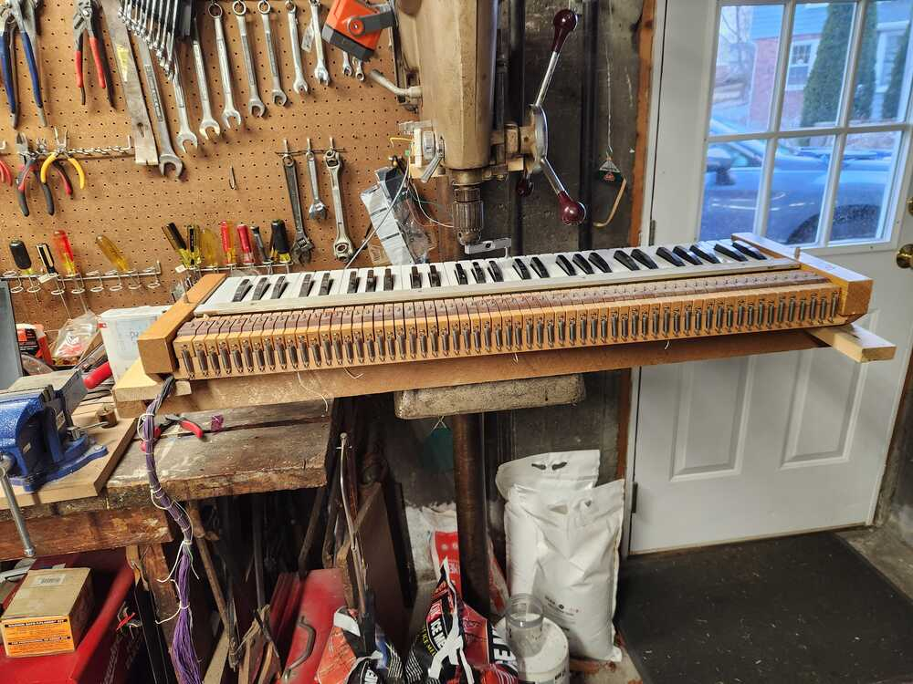
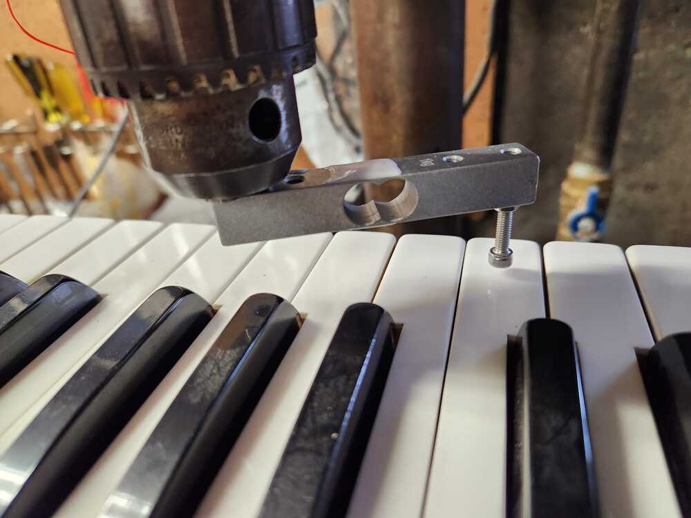
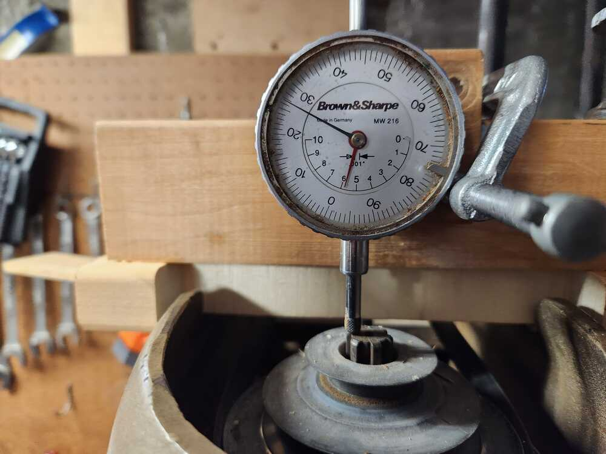
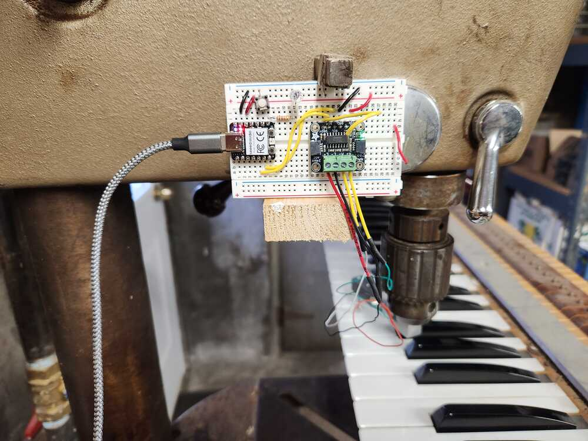
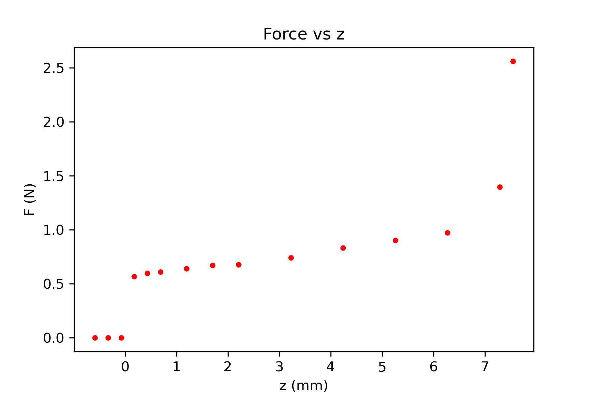

Documentation for Making a force measurement of keyboard.

1/2/25

## Use Tiny1624 adc in diff mode.

Resources

* [code from chatGPT, modified so that registers and mnemonics work.](./code/diff_adc01)  This code works, and claims to take 16 points.  Hook this up to strain gauge and see where we are.  Nowhere good, yet!
	* external reference?
	* measure time and maximize sampling within desired time.
	* lklk  
* [1624 datasheet](https://ww1.microchip.com/downloads/en/DeviceDoc/ATtiny1624-26-27-DataSheet-DS40002234A.pdf)
* [microship doc on github for adc diff modes](https://github.com/microchip-pic-avr-examples/attiny1627-how-to-use-the-12-bit-differential-adc-with-pga?tab=readme-ov-file)
* [header file on Spence Konde site for 1624](https://github.com/SpenceKonde/megaTinyCore/blob/4d0d75660ccfa72de79c9c4f15a8cd17c9f0ed16/megaavr/extras/ioheaders/iotn1624.h)
* [MegaTiny core site of Spence Konde](https://github.com/SpenceKonde/megaTinyCore/blob/master/megaavr/extras/ATtiny_x24.gif)

## Arduino library for NAU7802

* Example works.  Nice.  Need to find out what noise is on 320 sps setting.
* May be able to use LittleFS to save data files.  [Doc](https://arduino-pico.readthedocs.io/en/latest/fs.html)
* What does the [plugin](https://github.com/earlephilhower/arduino-pico-littlefs-plugin/blob/master/README.md) do?

##  First prototype and measurement

Set up strain gauge using Arduino library.  Looks like S/N about .5/1000 for 10 Hz operation.  Going up to 80 Hz, still 1/1000.  At highest speed, 320 Hz, up to 5/1000 and less stable in other ways.  Let's see what we can do at 80 Hz, and then look at tiny1624 for higher frequency.  If that does not work, there must be other ADC chips out there, or a good analog front end to amplify for the RP2040 ADC.

Attach strain gauge to drill press, use dial indicator for z-measurement.

	
	

This keyboard is from the Choir of the Rodgers 32B.  It has not been taken apart, not cleaned yet. Press key 20mm from front. Contacts close at 0.167" from top (4.2 mm). 

  
  

Take 25 samples and average.  SD for distribution still around 30 counts.  So sd on the mean is ~6.    

<figure>
  
 </figure>

Next, automate this and check other keys.  Build a device that can go measure the Flentrop organ and others.

* How to support in a way that can be used for any organ.
* How to tag speaking point?
* Can we get dynamic information with a motor-driven device at 80 Hz?  
* Will using tiny1624 be a better method?

