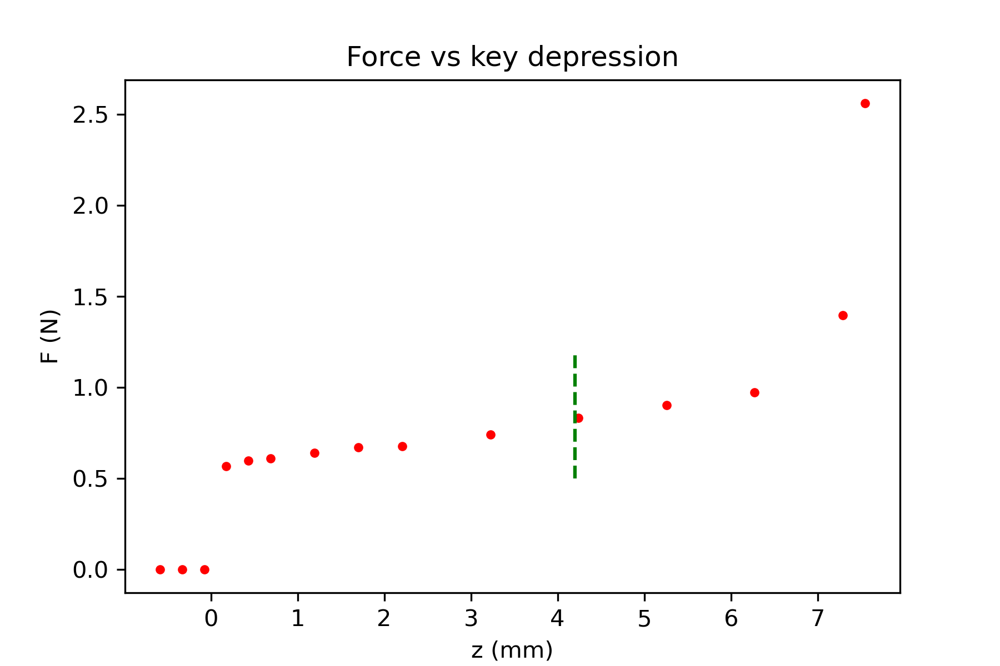

Documentation for Making a force measurement of keyboard.

1/2/25

## Use Tiny1624 adc in diff mode.

Resources

* [code from chatGPT, modified so that registers and mnemonics work.](./code/diff_adc01)  This code works, and claims to take 16 points.  Hook this up to strain gauge and see where we are.  Nowhere good, yet!
	* external reference?
	* measure time and maximize sampling within desired time.
	* lklk  
* [1624 datasheet](https://ww1.microchip.com/downloads/en/DeviceDoc/ATtiny1624-26-27-DataSheet-DS40002234A.pdf)
* [microship doc on github for adc diff modes](https://github.com/microchip-pic-avr-examples/attiny1627-how-to-use-the-12-bit-differential-adc-with-pga?tab=readme-ov-file)
* [header file on Spence Konde site for 1624](https://github.com/SpenceKonde/megaTinyCore/blob/4d0d75660ccfa72de79c9c4f15a8cd17c9f0ed16/megaavr/extras/ioheaders/iotn1624.h)
* [MegaTiny core site of Spence Konde](https://github.com/SpenceKonde/megaTinyCore/blob/master/megaavr/extras/ATtiny_x24.gif)

## Arduino library for NAU7802

* Example works.  Nice.  Need to find out what noise is on 320 sps setting.
* May be able to use LittleFS to save data files.  [Doc](https://arduino-pico.readthedocs.io/en/latest/fs.html)
* What does the [plugin](https://github.com/earlephilhower/arduino-pico-littlefs-plugin/blob/master/README.md) do?

<figure>
  
 </figure>

	
	

  
  

