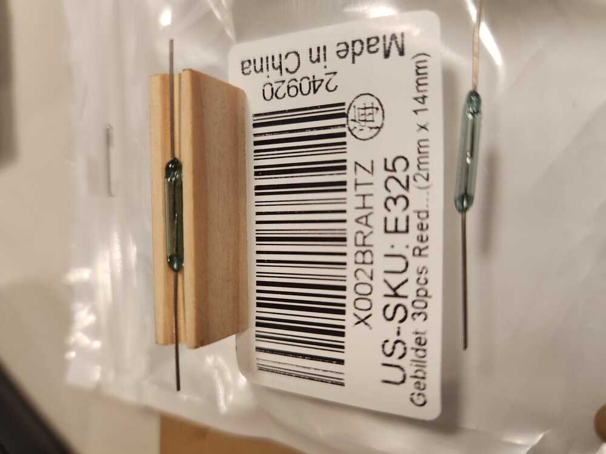
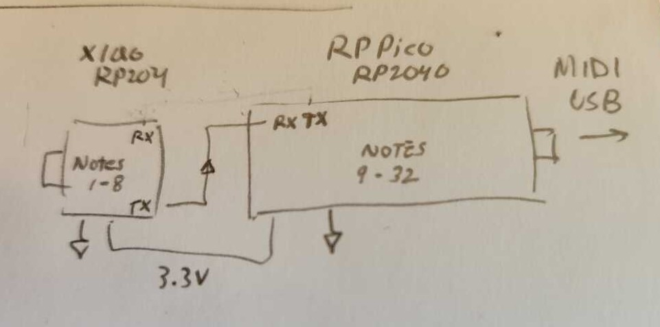

# MIDI modification of the pedals in the Rodgers 32B

  
  

Above, the magnetic reed switches from China, mounted into wood carriers.  They are slightly more sensitive than the old ones, so sit a few mm farther from the pedal magnets.  To be seen if they work together well.  Seems OK.     

<b>Here is a sketch of the proposed electronics for the pedal.</b>
<figure>
  
 </figure>

Small module captures notes 1-10  and sends serial message to RP Pico when a pedal note changes.  Larger board queries the rest of the pins and sends the needed message via USB MIDI.  That way, there is only one USB midi. There are three pins left over.  Use them for expression pedal? (remember to reserve ADC pins GP26, 27,28).