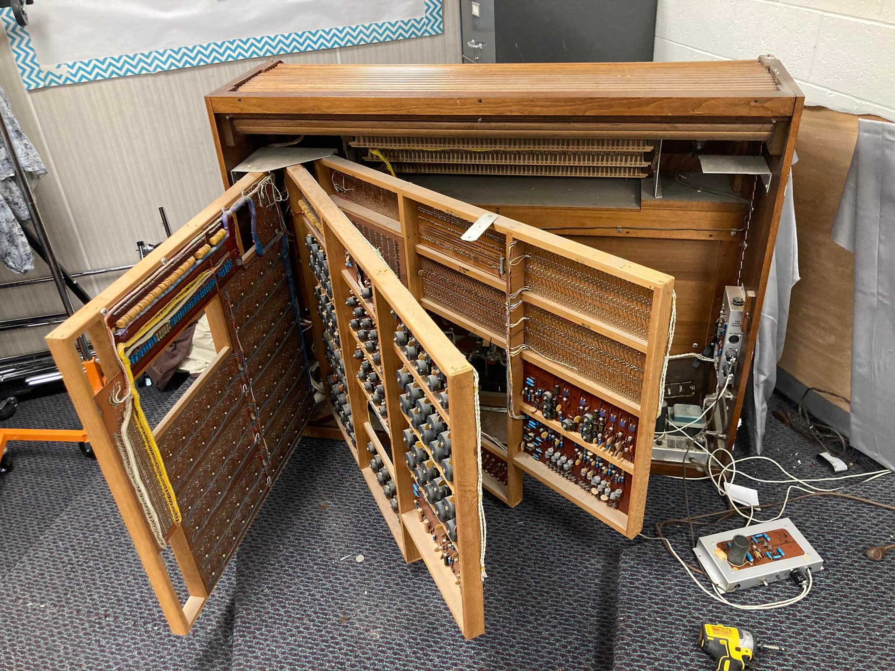
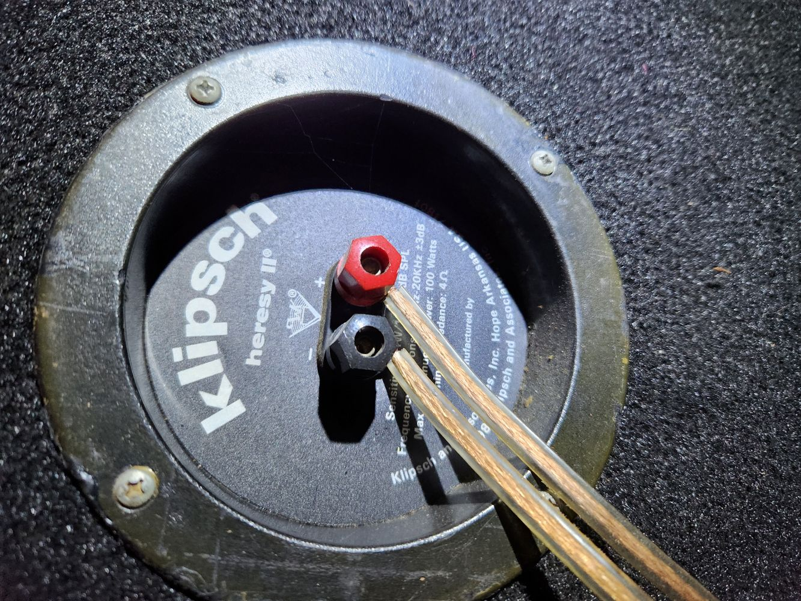
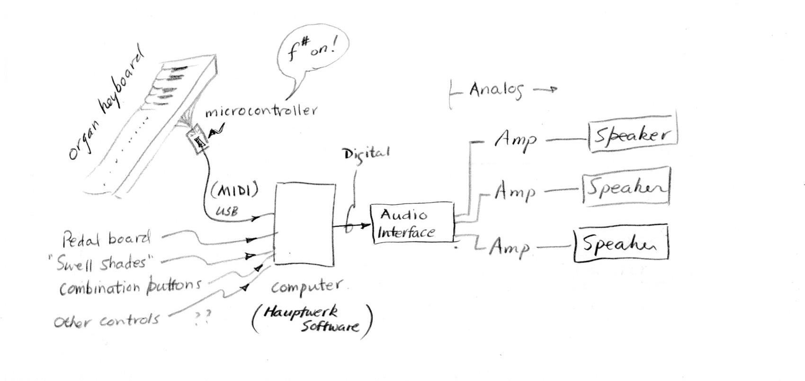
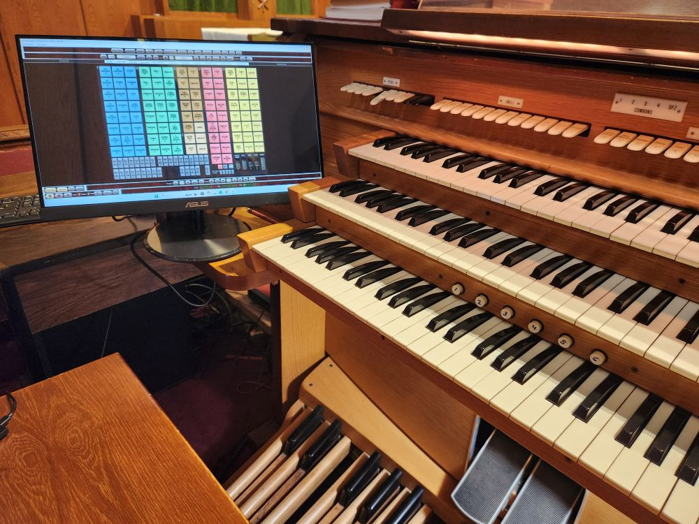

Documentation for COS organ project 2024 and beyond.

<figure>
  
 </figure>

Caption 1
<b><b>

<figure>
  
 </figure>

Caption 2
<b><b>

<figure>
  
 </figure>

Caption 3
<b><b>

<figure>
  
 </figure>

Caption 4
<b><b>

<figure>
  
 </figure>

Caption 5
<b><b>

<figure>
  
 </figure>

Caption 6
<b><b>