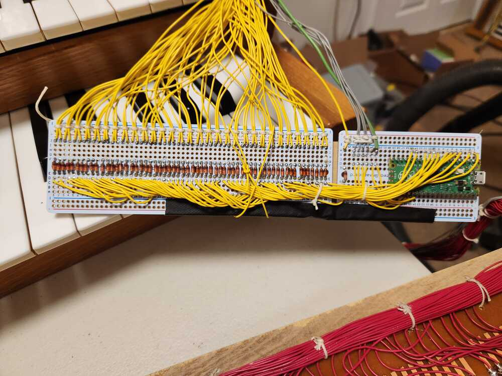
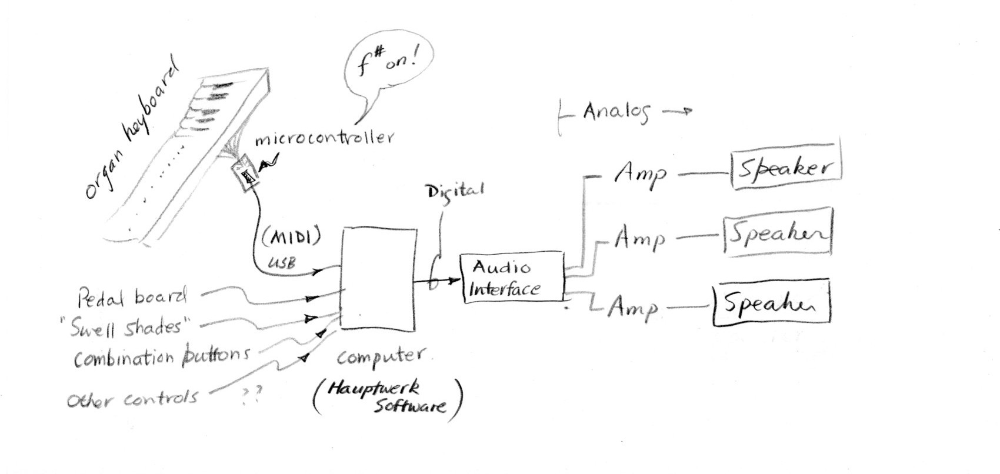

Documentation for COS organ project 2024 and beyond.

<figure>
  
 </figure>

<figure>
  
 </figure>

<figure>
  
 </figure>

<figure>
  
 </figure>

<figure>
  
 </figure>

<figure>
  
 </figure>
