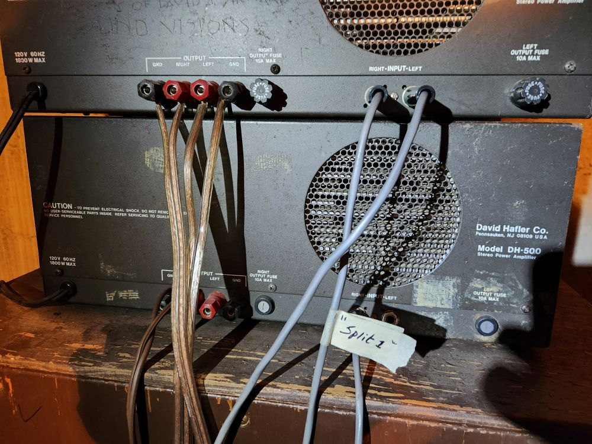

Documentation for COS organ project 2024 and beyond.

<b>

<figure>
  
 </figure>

Rodgers 32B console, opened to show components.  Early to mid 1960's.
  

<figure>
  
 </figure>

Circuitboard for the swell keys, with Raspberry Pi Pico board.
  

<figure>
  
 </figure>

High Quality Klipsch speaker from Jim Mouradian.
  

<figure>
  
 </figure>

Two BIG amplifiers from Jim as well.
  

<figure>
  
 </figure>

A cartoon description of the virtual organ setup.
  

<figure>
  
 </figure>

A view of the organ as it is currently played, with touchscreen controls.
  

</b>